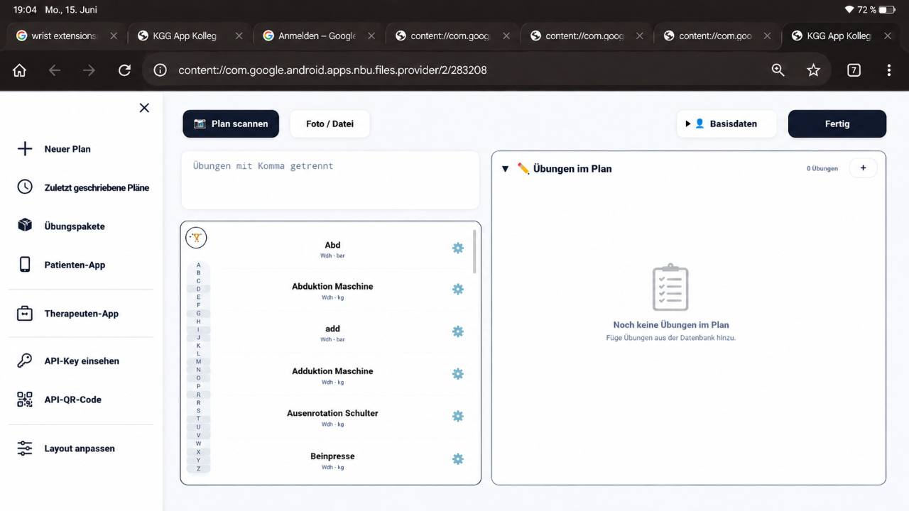
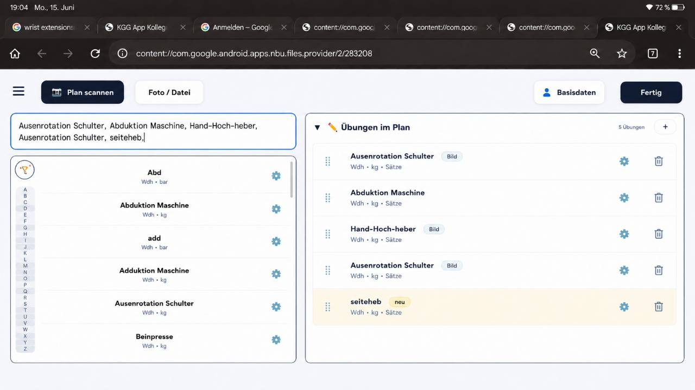

# Tablet Golden Layout Source of Truth

Status: v1, 2026-06-15

Diese Datei ist die verbindliche Grundlage fuer Admin-/Tablet-UI-Arbeit im Test-Lab. Vor jedem Tablet-Layout-Patch zuerst diese Datei lesen. Wenn Max den Tablet-Standard aendert, muss diese Datei im selben Patch aktualisiert werden.

## Referenzzustand

Leerzustand, Sidebar offen:

Aktiver Plan, Sidebar geschlossen:

## Golden-Regeln

- Tablet gilt ab `760px`; darunter muss die vorhandene Handy-UI greifen.
- Leerer Plan (`0 Uebungen`): Seitenleiste ist standardmaessig offen, als feste Dock-Leiste links sichtbar und reserviert echten Platz; Planbereich rechts bleibt sichtbar und zeigt einen Empty-State.
- Sobald der Plan von `0` auf `1+` Uebungen wechselt, schliesst die Seitenleiste genau einmal automatisch.
- Danach respektiert die App manuelles Oeffnen/Schliessen per Hamburger, Close, Backdrop oder Escape.
- Eine offene Tablet-Seitenleiste darf kein Blur-/Backdrop-Overlay ueber die Arbeitsflaeche legen.
- Tablet soll zwischen `760px` und grossen Landscape-Breiten skalieren, ohne gequetschte Zwischenlayouts oder ueberlappende Actions.
- Die A-Z-Leiste bleibt im Golden-Layout eine kompakte vertikale Schnellleiste wie in der Referenz.

## Nicht Anfassen In Tablet-Patches

- PDF-Erzeugung
- QR/Patient:innen-App
- Scan/OCR
- Parser
- Plan-State als Datenmodell
- Medien-/Upload-Core
- API-Key-Logik
- Android/APK-Build

## Aktuelle Implementierung

- Testdatei: `therapist-app/test-lab/modern-base/KGG_APP_ADMIN_v390_local_p07_tablet_dock_source_truth.html`
- Basis: `KGG_APP_ADMIN_v390_local_p06_parser_formats.html`
- QA-Modus: `?qa=1`

## Aenderungsregel

Jede spaetere Tablet-UI-Aenderung muss diese Datei bewusst aktualisieren, wenn sie eine Golden-Regel oder Referenzansicht veraendert. Neue Screenshots gehoeren nach `therapist-app/test-lab/tablet-golden/assets/` und werden hier verlinkt.
